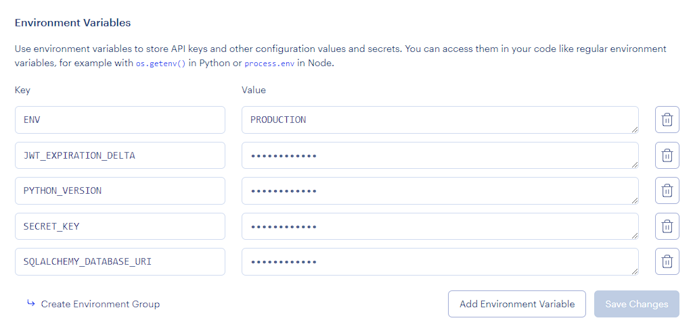

<a href="https://render.com/deploy?repo=https://github.com/DSS-3604/flask-3604">
  
</a>


# Flask Backend for INFO 3604 Project by DSS
- Based on the [Flask MVC Template](https://github.com/uwidcit/flaskmvc) by [UWIDCIT](https://github.com/uwidcit)

# Dependencies
* Python3/pip3
* Packages listed in requirements.txt

# Installing Dependencies
```bash
$ pip install -r requirements.txt
```

# Configuration Management

Configuration information such as the database url/port, credentials, API keys, etc. are to be supplied to the application. However, it is bad practice to stage production information in publicly visible repositories.
Instead, all config is provided by a config file or via [environment variables](https://linuxize.com/post/how-to-set-and-list-environment-variables-in-linux/).

## In Development

When running the project in a development environment (such as gitpod) the app is configured via config.py file in the App folder. By default, the config for development uses a sqlite database.

config.py
```python
SQLALCHEMY_DATABASE_URI = "sqlite:///temp-database.db"
SECRET_KEY = "secret key"
JWT_EXPIRATION_DELTA = 7
ENV = "DEVELOPMENT"
```

## In Production

When deploying your application to production/staging you must pass
in configuration information via environment tab of your render project's dashboard.




# Running the Project

_For development run the serve command (what you execute):_
```bash
$ flask run
```

_For production using gunicorn (what heroku executes):_
```bash
$ gunicorn wsgi:app
```

# Deploying
You can deploy your version of this app to heroku by clicking on the "Deploy to RENDER" link above.

# Initializing the Database
When connecting the project to a fresh empty database ensure the appropriate configuration is set then run the following command.

```bash
$ flask init
```

# Database Migrations
If changes to the models are made, the database must be 'migrated' so that it can be synced with the new models.
Then execute following commands using manage.py. More info [here](https://flask-migrate.readthedocs.io/en/latest/)

```bash
$ flask db init
$ flask db migrate
$ flask db upgrade
$ flask db --help
```

# Testing

## Unit & Integration
Unit and Integration tests are created in the App/test directory.

You can run all application tests with the following command

```bash
$ pytest
```

## Test Coverage

You can generate a report on your test coverage via the following commands

```bash
$ coverage run -m pytest
$ coverage report
```

You can also generate a detailed html report in a directory named htmlcov with the following command

```bash
$ coverage run -m pytest
$ coverage html
```

## Database Issues

If you are adding models you may need to migrate the database with the commands given in the previous database migration section. Alternatively you can delete your database file.
